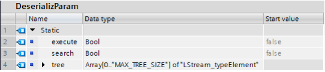
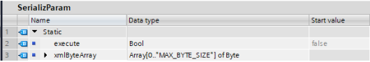
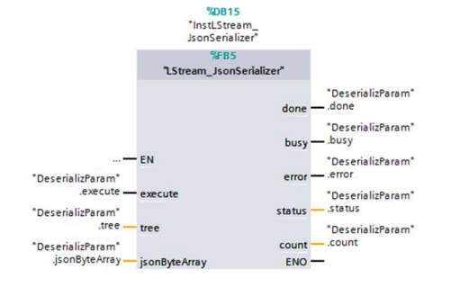
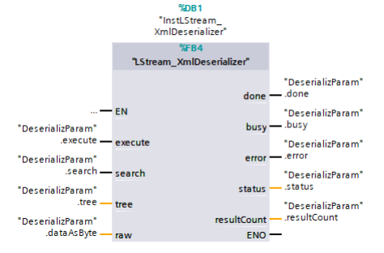
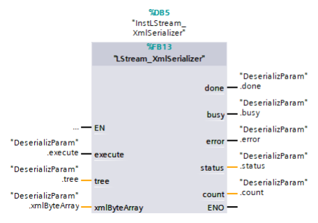

# How to Use the LStream Library

## Table of Contents
1. [Introduction](#1-introduction)

1.1 [Overview](#11-overview)

1.2 [Functionality](#12-functionality)

1.3 [Restrictions and Requirements](#13-restrictions-and-requirements)

1.4 [Components Used](#14-components-used)

2. [Engineering](#2-engineering)

2.1 [Components of the Library](#21-components-of-the-library)

2.2 [Interface Description](#22-interface-description)

2.2.1 [LStream_JsonDeserializer](#221-lstream_jsondeserializer)

2.2.2 [LStream_JsonSerializer](#222-lstream_jsonserializer)

2.2.3 [LStream_XmlDeserializer](#223-lstream_xmldeserializer)

2.2.4 [LStream_XmlSerializer](#224-lstream_xmlserializer)

2.2.5 [LStream_FindStringInByteCharArrayAdv](#225-lstream_findstringinbytechararrayadv)

2.2.6 [LStream_typeElement](#226-lstream_typeelement)

2.3 [Integration into the User Project](#23-integration-into-the-user-project)

3. [Additional Information](#3-additional-information)

3.1 [The JavaScript Object Notation (JSON) Data Exchange Format](#31-the-javascript-object-notation-json-data-exchange-format)

3.2 [JSON Representation in a Tree](#32-json-representation-in-a-tree)

3.3 [Extensible Markup Language (XML)](#33-extensible-markup-language-xml)

3.4 [Library in the TIA Portal](#34-library-in-the-tia-portal)

4. [Appendix](#4-appendix)

4.1 [Service and Support](#41-service-and-support)

4.2 [Industry Mall](#42-industry-mall)

4.3 [Links and Literature](#43-links-and-literature)

4.4 [Change Documentation](#44-change-documentation)

## 1. Introduction

### 1.1 Overview

In computer science, a stream is a sequence of data elements that are made available over time. Examples of these data element sequences include data formats such as JSON or XML. These are increasingly being used for the exchange of data from or to a web server. Due to the increasing use of networking within plants and the advancement of the Internet of Things (IoT), the exchange of data using JSON or XML format plays an increasingly important role in automation technology. The LStream library makes it possible to convert the JSON and XML data formats into a format that is more compatible with a SIMATIC S7 Controller for further processing. It can also be used to create an XML format from abstract data for further processing.

### 1.2 Functionality

The LStream library provides function blocks that can be used to deserialize JSON and XML data streams for the user program and to serialize them again from the user program.

### 1.3 Restrictions and Requirements

Because of system behavior of the SIMATIC PLC and because datatypes of strings/characters have been chosen to be String/Byte (because of memory optimization) it is only possible to serialize/deserialize streams with ASCII encoding. Any other encoding will lead to undefined behavior and might cause issues while serializing/deserializing.

Additionally, the length of strings (e.g., values of XML/JSON elements/attributes) is restricted to a maximum of 256 characters. There is no workaround for these restrictions; if the functionality is required the user must adjust the library code.

#### Requirements JSON

The incoming JSON stream must be formatted in a compressed form:
- Line breaks are not allowed
- No spaces or whitespaces outside of values

**Code example 1-1 open JSON format:**

```json
{
  "glossary": {
    "title": "example glossary",
    "GlossDiv": [
      "XML",
      "S"
    ]
  }
}
```

### 1.4 Components Used

This library was created with these hardware and software components:

**Table 1-3**

| Components                       | Quantity | Article number         | Note       |
|----------------------------------|----------|------------------------|------------|
| SIMATIC CPU 1517TF-3 PN/DP       | 1        | 6ES7517-3UP00-0AB0     | FW 2.8     |
| SIMATIC STEP 7 Professional V18  | 1        | 6ES7822-1AA08-0YA5     | Update 1   |

This library consists of the following components:

**Table 1-4**

| Components                       | File name                        | Note       |
|----------------------------------|----------------------------------|------------|
| Documentation                    | 109781165_LStream_DOC_v1_6_de.pdf| This document |
| Block library and example project for TIA Portal V18 | 109781165_LStream_LIB_v1_6.zip | - |

Note: The library was additionally tested with a SIMATIC S7-1214C FW 4.4 and a SIMATIC S7-1511 FW 2.8.

## 2. Engineering

### 2.1 Components of the Library

Function blocks and functions

**Table 2-1: Function blocks and functions of the Library**

| Name                              | Version | Description                                                      |
|-----------------------------------|---------|------------------------------------------------------------------|
| LStream_JsonDeserializer          | V1.6.0  | Deserializes a compressed JSON data stream into a sequence of data/objects. |
| LStream_JsonSerializer            | V1.6.0  | Serializes a sequence of data/objects into a compressed JSON data stream.    |
| LStream_XmlDeserializer           | V1.6.0  | Deserializes an XML data stream into a sequence of data/objects.             |
| LStream_XmlSerializer             | V1.6.0  | Serializes a sequence of data/objects into an XML data stream.               |
| LStream_FindStringInByteCharArrayAdv | V1.6.0  | Searches an array of bytes for a given string.                                |
| LStream_WriteOutString            | V1.6.0  | Writes a string into the target array of bytes and checks for bound violations. |

PLC Data Types

**Table 2-2: PLC library data types**

| Name                | Version | Description                                                      |
|---------------------|---------|------------------------------------------------------------------|
| LStream_typeElement | V1.6.0  | Data type for storing and reading data/objects. Data is stored as a key-value pair. |

### 2.2 Interface Description

#### 2.2.1 LStream_JsonDeserializer


**Table 2-3: Parameter "LStream_JsonDeserializer"**

| Name        | Declaration | Data type                  | Description                                                                 |
|-------------|-------------|----------------------------|-----------------------------------------------------------------------------|
| execute     | Input       | Bool                       | Rising edge starts deserialization of the JSON data stream.                 |
| search      | Input       | Bool                       | Only the keys given are deserialized from the JSON data stream.             |
| done        | Output      | Bool                       | Job concluded.                                                              |
| busy        | Output      | Bool                       | Job is being processed.                                                     |
| error       | Output      | Bool                       | An error has occurred in the processing of the FB.                          |
| status      | Output      | Word                       | Internal status/error code of the FB, see Table 2-4.                        |
| resultCount | Output      | Int                        | Number of JSON elements deserialized.                                       |
| tree        | InOut       | Array[*] of "LStream_typeElement" | JSON tree containing the deserialized data, see Section 2.2.6.              |
| raw         | InOut       | Array[*] of Byte           | Compressed JSON data stream.                                                |

**Status and error displays**

**Table 2-4: Status/error codes**

| Status   | Meaning                                               | Remedy/notes |
|----------|-------------------------------------------------------|--------------|
| 16#0000  | Execution completed without errors.                   | -            |
| 16#7000  | No job is currently being processed.                  | -            |
| 16#7001  | First call after new job (rising edge at "execute").  | -            |
| 16#7002  | Subsequent call during active processing without further details. | -            |
| 16#8201  | Error: Array provided is too small.                   | -            |
| 16#8401  | Error: No raw data available.                         | -            |
| 16#8600  | Error: Error due to an undefined state in the state machine. | -            |

**Functionality**

With a rising edge as the "execute" parameter, the block deserializes the complete array of bytes provided as the "raw" parameter based on the JSON syntax. The result of the deserialization is output as the "tree" parameter.

If the "search" parameter is set, the array of bytes provided as the "raw" parameter is only searched for predefined objects/keys. These keys must be written as the "tree" parameter before the block is executed.

If the FB has completed processing, the output parameter "done" is set and the number of deserialized objects is output as the "resultCount" output.

If an error occurs, the FB aborts processing and sets the output parameter "error" to "TRUE". An error code is output as the output parameter "status".

Note: Deserialization can take a long time; therefore, the FB works asynchronously (i.e., several call cycles are required for processing). The number of cycles depends on the size of the JSON data stream. With each call, the data stream is processed for the duration defined with the constant MAX_LOOP_TIME (3ms by default).

Note: As soon as the number of deserialized JSON objects exceeds the size of the tree structure — the "tree" parameter — the processing is aborted. All objects that have been deserialized to date are stored in the tree structure.

#### 2.2.2 LStream_JsonSerializer


**Table 2-5: Parameters of LStream_JsonSerializer**

| Name         | Declaration | Data type                  | Description                                                                 |
|--------------|-------------|----------------------------|-----------------------------------------------------------------------------|
| execute      | Input       | Bool                       | Rising edge starts serialization                                            |
| done         | Output      | Bool                       | Serialization completed                                                     |
| busy         | Output      | Bool                       | Serialization is being processed                                            |
| error        | Output      | Bool                       | An error has occurred in the processing of the FB                           |
| status       | Output      | Word                       | Internal status/error code of the FB, see Table 2-6.                        |
| count        | Output      | UInt                       | Number of byte elements in a Byte Array.                                    |
| tree         | InOut       | Array[*] of "LStream_typeElement" | JSON tree containing the serialized data, see Section 2.2.6.              |
| jsonByteArray| InOut       | Array[*] of Byte           | JSON data stream as array of bytes                                          |

**Status and error displays**

**Table 2-6: Status/error codes**

| Status   | Meaning                                               | Remedy/notes |
|----------|-------------------------------------------------------|--------------|
| 16#0000  | Job completed without errors                          | -            |
| 16#7000  | No job active                                          | -            |
| 16#7001  | First call of the command                              | -            |
| 16#7002  | Follow-up call of the command (command still running, "busy" = true) | -            |
| 16#8201  | Error: Array provided is too small.                   | -            |
| 16#8401  | Error: Undefined type.                                | -            |
| 16#8402  | Error: JSON nesting depth exceeds allowed depth       | Adjust STACK_SIZE |
| 16#8403  | Error: JSON depth not specified in tree structure     | Specify depth |
| 16#8600  | Error: Error due to an undefined state in the state machine. | -            |
| 16#8601  | Error: Provided tree structure too small              | Enlarge tree structure |
| 16#8602  | Error: Provided array of bytes too small              | Enlarge array |
| 16#8603  | Error: Stack too small                                | See error 16#8402 |

**Functionality**

With a rising edge at the "execute" parameter, the block serializes the array of LStream_typeElement provided as the "tree" parameter. The JSON data stream is output as a byte array.

The FB terminates serialization as soon as it has reached the end of the array of LStream_typeElement, or it analyzes an uninitialized element.

When the FB has completed processing, the output parameter "done" is set and the number of bytes written is output as the "count" output.

If an error occurs, the FB aborts processing and sets the output parameter "error" to "TRUE". An error code is output as the output parameter "status".

Note: Serialization can take a long time; therefore, the FB works asynchronously (i.e., several call cycles are required for processing). The number of cycles depends on the size of the tree structure. With each call, the strings are processed for the duration defined with the constant MAX_REPEAT_TIME (3ms by default).

Note: The hierarchical structure of the JSON must be correctly reflected in the tree structure, starting with the root element with a depth of 1.

Note: For serialization, the correct type of object must be specified in the tree structure. Permitted types are Element (0), Array (1), String (2), Number (3) and Bool (4); for more information see Table 2-12.

#### 2.2.3 LStream_XmlDeserializer

**Table 2-7: Parameters of LStream_XmlDeserializer**

| Name        | Declaration | Data type                  | Description                                                                 |
|-------------|-------------|----------------------------|-----------------------------------------------------------------------------|
| execute     | Input       | Bool                       | Rising edge starts deserialization of the XML data stream.                  |
| search      | Input       | Bool                       | Only the keys given are deserialized from the XML data stream.              |
| done        | Output      | Bool                       | Job concluded.                                                              |
| busy        | Output      | Bool                       | Job is being processed.                                                     |
| error       | Output      | Bool                       | An error has occurred in the processing of the FB.                          |
| status      | Output      | Word                       | Internal status/error code of the FB, see Table 2-8.                        |
| resultCount | Output      | Int                        | Number of XML elements deserialized.                                        |
| tree        | InOut       | Array[*] of "LStream_typeElement" | XML tree containing the deserialized data, see Section 2.2.6.              |
| raw         | InOut       | Array[*] of Byte           | XML data stream.                                                            |

**Status and error displays**

**Table 2-8: Status/error codes**

| Status   | Meaning                                               | Remedy/notes |
|----------|-------------------------------------------------------|--------------|
| 16#0000  | Execution completed without errors.                   | -            |
| 16#7000  | No job is currently being processed.                  | -            |
| 16#7001  | First call after new job (rising edge at "execute").  | -            |
| 16#7002  | Subsequent call during active processing without further details. | -            |
| 16#8201  | Error: Array provided is too small.                   | -            |
| 16#8401  | Error: No raw data available.                         | -            |
| 16#8600  | Error: Error due to an undefined state in the state machine. | -            |

**Functionality**

With a rising edge as the "execute" parameter, the block deserializes the complete array of bytes provided as the "raw" parameter based on the XML syntax. The result of the deserialization is output as the "tree" parameter.

If the "search" parameter is set, the array of bytes provided as the "raw" parameter is only searched for predefined objects/keys. These keys must be written as the "tree" parameter before the block is executed.

If the FB has completed processing, the output parameter "done" is set and the number of deserialized objects is output as the "resultCount" output.

If an error occurs, the FB aborts processing and sets the output parameter "error" to "TRUE". An error code is output as the output parameter "status".

Note: Deserialization can take a long time; therefore, the FB works asynchronously (i.e., several call cycles are required for processing). The number of cycles depends on the size of the XML data stream. With each call, the data stream is processed for the duration defined with the constant MAX_LOOP_TIME (3ms by default).

Note: As soon as the number of deserialized XML objects exceeds the size of the tree structure — the "tree" parameter — the processing is aborted. All objects that have been deserialized to date are stored in the tree structure.

#### 2.2.4 LStream_XmlSerializer

**Table 2-9: Parameters of LStream_XmlSerializer**

| Name         | Declaration | Data type                  | Description                                                                 |
|--------------|-------------|----------------------------|-----------------------------------------------------------------------------|
| execute      | Input       | Bool                       | Rising edge starts serialization                                            |
| done         | Output      | Bool                       | Serialization completed                                                     |
| busy         | Output      | Bool                       | Serialization is being processed                                            |
| error        | Output      | Bool                       | An error has occurred in the processing of the FB                           |
| status       | Output      | Word                       | Internal status/error code of the FB, see Table 2-10.                       |
| count        | Output      | UInt                       | Number of byte elements in Byte Array.                                      |
| tree         | InOut       | Array[*] of "LStream_typeElement" | XML tree containing the serialized data, see Section 2.2.6.              |
| xmlByteArray | InOut       | Array[*] of Byte           | XML data stream as array of bytes                                           |

**Status and error displays**

**Table 2-10: Status/error codes**

| Status   | Meaning                                               | Remedy/notes |
|----------|-------------------------------------------------------|--------------|
| 16#0000  | Job completed without errors                          | -            |
| 16#7000  | No job active                                          | -            |
| 16#7001  | First call of the command                              | -            |
| 16#7002  | Follow-up call of the command (command still running, "busy" = true) | -            |
| 16#8201  | Error: Array provided is too small.                   | -            |
| 16#8401  | Error: Undefined type.                                | -            |
| 16#8402  | Error: XML nesting depth exceeds allowed depth        | Adjust STACK_SIZE |
| 16#8403  | Error: XML depth not specified in tree structure      | Specify depth |
| 16#8600  | Error: Error due to an undefined state in the state machine. | -            |
| 16#8601  | Error: Provided tree structure too small              | Enlarge tree structure |
| 16#8602  | Error: Provided array of bytes too small              | Enlarge array |
| 16#8603  | Error: Stack too small                                | See error 16#8402 |

**Functionality**

With a rising edge at the "execute" parameter, the block serializes the array of LStream_typeElement provided as the "tree" parameter. The XML data stream is output as a byte array.

The FB terminates serialization as soon as it has reached the end of the array of LStream_typeElement, or it analyzes an uninitialized element.

When the FB has completed processing, the output parameter "done" is set and the number of bytes written is output as the "count" output.

If an error occurs, the FB aborts processing and sets the output parameter "error" to "TRUE". An error code is output as the output parameter "status".

Note: Serialization can take a long time; therefore, the FB works asynchronously (i.e., several call cycles are required for processing). The number of cycles depends on the size of the larger tree structure. With each call, the strings are processed for the duration defined with the constant MAX_REPEAT_TIME (3ms by default).

Note: The hierarchical structure of the XML must be correctly reflected in the tree structure, starting with the root element with a depth of 1.

Note: For serialization, the correct type of object must be specified in the tree structure. Permitted types are element (0), attribute (1); for more information see Table 2-12.

#### 2.2.5 LStream_FindStringInByteCharArrayAdv

**Description**

The function "LStream_FindStringInByteCharArrayAdv" searches an array of bytes for a string and returns the position of the first usage location. The start index for the search function is passed as the parameter "startPosition".

**Parameters**


**Table 2-11: Parameters of LStream_FindStringInByteCharArrayAdv**

| Name          | Declaration | Data type        | Description                                      |
|---------------|-------------|------------------|--------------------------------------------------|
| searchFor     | Input       | String           | Text that is being searched for.                 |
| startPosition | Input       | DInt             | Start position of the search in the array.       |
| searchIn      | InOut       | Array[*] of Byte | Array of bytes to be searched.                   |
| Ret_Val       | Return      | DInt             | Position (index) of the searched string in the array. -1: String was not found. |

#### 2.2.6 LStream_typeElement

The PLC data type "LStream_typeElement" keeps the data/objects of the JSON and XML data streams in a format that can be used by the SIMATIC S7 Controller. The data is held in a key-value pair. In addition, there is the hierarchical depth of the object, as well as its type identifier.

**Table 2-12: Parameters of LStream_typeElement**

| Name           | Data type | Value | Description                                                                 |
|----------------|-----------|-------|-----------------------------------------------------------------------------|
| type           | SInt      | -1    | Serves as the type identifier of the element. Where -1 is the initial value, which corresponds to an undefined type. When the UDT is used in the context of a JSON structure, 0 represents an object, 1 represents an array, 2 represents a string, 3 represents a number and 4 represents a Bool. When the UDT is used in the context of an XML structure, 0 represents an element, 1 represents an attribute. |
| key            | String    | ''    | Name of the key                                                             |
| value          | String    | 'NULL'| Name of the key value                                                       |
| depth          | SInt      | -1    | Hierarchical depth of the object                                            |
| closingElement | Bool      | false | The element is the last element of an object or array; True=Closing element; Only applicable for JSON functionality |

### 2.3 Integration into the User Project

#### Requirement
 The library requires that the data to be deserialized/serialized is available in a data block.

#### Integrating the block into the user program:

For general information on dealing with libraries in the TIA Portal, see section 3.4.

1. Open the "LStream" library in the TIA Portal.
2. Open the folder "Types > LStream" and drag the FB for the desired stream method into the "Program blocks" folder of your PLC. The corresponding functions and PLC data types are automatically copied into your project.
3. Create a DB for controlling and evaluating the FB and open it.
4. At minimum, create the following variables for deserialization:

**Figure 2-6: DB "DeserializParam" for controlling and interpreting the FB**



> **Note:** Create the variable of the data type "Array[x] of LStream_typeElement" with sufficient size for your application. Note that the array must start with "0".

5. If you use an FB for serialization, you must, at minimum, create the following variables:

**Figure 2-7: DB "SerializParam" for controlling and interpreting the FB**



> **Note:** Create the variable of the data type "Array[x]" of bytes with a size sufficient for your application. Note that the array must start with "0".

6. Call the FB at the desired location and create an instance.
7. Connect the parameters of the FB with the variables from the previously created DBs.

**Figure 2-8: Calling the FB "LStream_JsonDeserializer"**


**Figure 2-9: Calling the FB "LStream_JsonSerializer"**



**Figure 2-10: Calling the FB "LStream_XmlDeserializer"**



**Figure 2-11: Calling the FB "LStream_XmlSerializer"**




8. Load the project into the PLC.

## 3. Additional Information

### 3.1 The JavaScript Object Notation (JSON) Data Exchange Format

JavaScript Object Notation (JSON) is an easy-to-use, text-based, language-independent data exchange format. It was derived from the ECMAScript Programming Language Standard. JSON defines a small set of formatting rules for portable representation of structured data.

As such, JSON can be used to transfer data in a structured manner between a client and a server application. The format allows for structural evaluation and is readable by both humans and machines.

The JSON format defines 6 structural tokens:
- [ : Left square bracket
- { : Left curly bracket
- ] : Right square bracket
- } : Right curly bracket
- : : Colons
- , : Comma

In addition, insignificant spaces are defined, which are ignored if they are not enclosed in quotation marks ("). These spaces are:
- Space with ASCII code 16#20
- Tab with ASCII code 16#09
- Line feed with ASCII code 16#0A
- Line break (CarriageReturn) with ASCII code 16#0D

There are also 3 literals defined:
- false
- true
- null

### 3.2 JSON Representation in a Tree

Since JSON is a structured format with an easy-to-understand structure, representing it as a list of key-value pairs is the obvious choice. The list is embedded in an array of key-value pair elements. Each of the array elements contains a link to the next list elements. This way, the list does not necessarily have to follow linear array indexing. It allows embedding sub-lists used for the nested JSON substructures such as objects and arrays.

### 3.3 Extensible Markup Language (XML)

Extensible Markup Language (XML) is a simple, very flexible text format derived from SGML (ISO 8879). Originally developed to meet the challenges of large-scale electronic publishing, XML is also playing an increasingly important role in the exchange of a wide variety of data on the web and elsewhere.

For more information about XML, see the following links:
- [W3C XML](https://www.w3.org/XML/)
- [W3Schools XML](https://www.w3schools.com/xml)

### 3.4 Library in the TIA Portal

## 4. Appendix

### 4.1 Service and Support

**Industry Online Support**

Do you have any questions or need assistance? Siemens Industry Online Support offers round the clock access to our entire service and support know-how and portfolio. The Industry Online Support is the central address for information about our products, solutions and services. Product information, manuals, downloads, FAQs, application examples and videos – all information is accessible with just a few mouse clicks:
[support.industry.siemens.com](https://support.industry.siemens.com)

**Technical Support**

The Technical Support of Siemens Industry provides you fast and competent support regarding all technical queries with numerous tailor-made offers – ranging from basic support to individual support contracts. Please send queries to Technical Support via Web form:
[siemens.com/SupportRequest](https://siemens.com/SupportRequest)

**SITRAIN – Digital Industry Academy**

We support you with our globally available training courses for industry with practical experience, innovative learning methods and a concept that’s tailored to the customer’s specific needs. For more information on our offered trainings and courses, as well as their locations and dates, refer to our web page:
[siemens.com/sitrain](https://siemens.com/sitrain)

**Service Offer**

Our range of services includes the following:
- Plant data services
- Spare parts services
- Repair services
- On-site and maintenance services
- Retrofitting and modernization services
- Service programs and contracts

You can find detailed information on our range of services in the service catalog web page:
[support.industry.siemens.com/cs/sc](https://support.industry.siemens.com/cs/sc)

**Industry Online Support App**

You will receive optimum support wherever you are with the "Siemens Industry Online Support" app. The app is available for iOS and Android:
[support.industry.siemens.com/cs/ww/en/sc/2067](https://support.industry.siemens.com/cs/ww/en/sc/2067)

### 4.2 Industry Mall

The Siemens Industry Mall is the platform on which the entire Siemens Industry product portfolio is accessible. From the selection of products to the order and the delivery tracking, the Industry Mall enables the complete purchasing processing – directly and independently of time and location:
[mall.industry.siemens.com](https://mall.industry.siemens.com)

### 4.3 Links and Literature

| Nr. | Thema                                      | Link                                                                 |
|-----|--------------------------------------------|----------------------------------------------------------------------|
| 1 | Siemens Industry Online Support            | [support.industry.siemens.com](https://support.industry.siemens.com) |
| 2 | Link to the SIOS page of the library for TIA Portal only | [support.industry.siemens.com/cs/ww/en/view/109781165](https://support.industry.siemens.com/cs/ww/en/view/109781165) |

### 4.4 Change Documentation

| Version | Date     | Modifications                                 |
|---------|----------|-----------------------------------------------|
| V1.0    | 04/2021  | First version                                 |
| V1.1    | 11/2021  | JSON Deserializer and JSON Serializer added   |
| V1.6    | 04/2023  | Rework and optimizations of JSON & XML functionality |

## Legal Information

The use of the LStream library is subject to the terms and conditions outlined in the license agreement. Unauthorized use, duplication, or distribution of the library or its components is strictly prohibited.

## Additional Information

For further assistance, refer to the official documentation provided with the LStream library or contact the support team.
